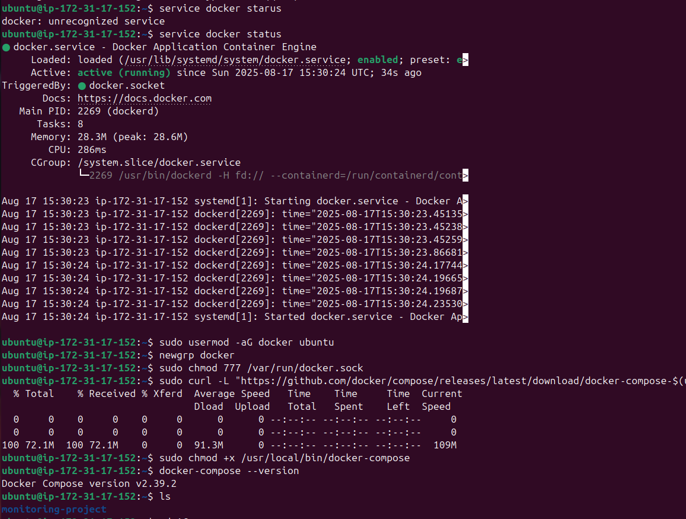
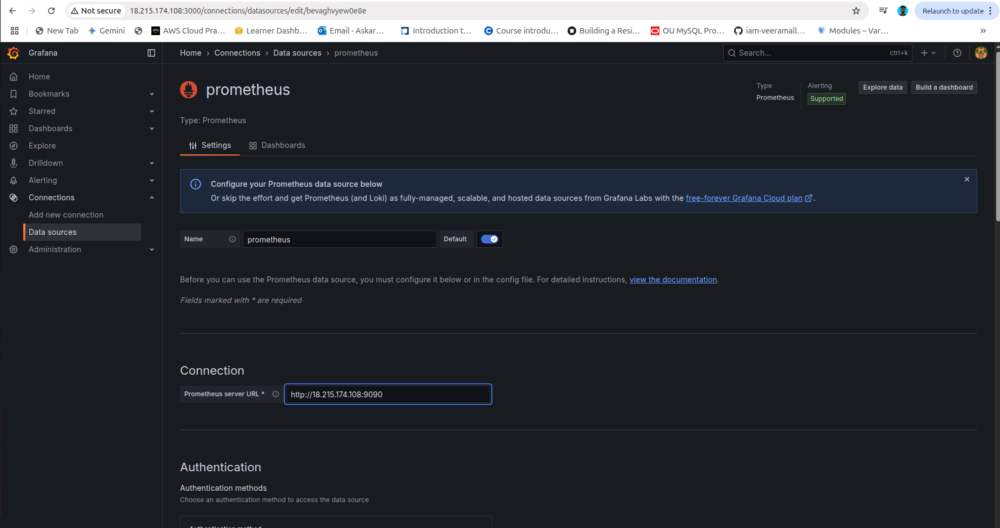

# 🚀 EC2 Monitoring with Prometheus & Grafana (via Docker Compose)
Monitor your EC2 (or any Linux server) effortlessly using **Node Exporter**, **Prometheus**, and **Grafana**, all deployed with Docker Compose.


## 🚀 Tech Stack

- **Prometheus** – Collects and scrapes metrics from Node Exporter.
- **Grafana** – Visualizes metrics with interactive dashboards.
- **Node Exporter** – Exposes EC2/Linux system metrics like CPU, memory, and disk usage.
- **Docker Compose** – Orchestrates Prometheus and Grafana containers for easy deployment.

## 📁 Folder Structure

 build-process/docker-compose.yml
   monitoring/prometheus.yml  
     README.md


## 🛠 Step 1: Create EC2 Instance

1. Log in to your **AWS Management Console**.
2. Navigate to **EC2** service.
3. Click **Launch Instance**.
4. Choose an **Amazon Machine Image (AMI)**, e.g., Ubuntu 22.04 LTS.
5. Select an **Instance Type**, e.g., `t2.micro` (for testing) or larger for production.
6. Configure **Instance Details** as needed.
7. Add **Storage** if required.
8. Add **Tags** (optional) for identification.
9. Configure **Security Group**:
   - Allow **SSH (port 22)** for your IP.
   - Allow **HTTP (port 80)** or **Custom Ports** if needed.
10. Review and **Launch** the instance.
11. Download the **key pair (.pem file)** to access your instance via SSH.


## 🛠 Step 2: Necessary Packages Installation on AWS EC2

Install these packages on your EC2 instance:
```bash
# Updates the package index
sudo apt-get update -y

# Installs Nginx web server
sudo apt install nginx -y

# Installs Docker
sudo apt install docker.io -y

# Adds 'ubuntu' user to 'docker' group
sudo usermod -aG docker ubuntu

# Applies new group membership without reboot
newgrp docker

# Sets full permissions on Docker socket
sudo chmod 777 /var/run/docker.sock

# Downloads latest Docker Compose
sudo curl -L "https://github.com/docker/compose/releases/latest/download/docker-compose-$(uname -s)-$(uname -m)" -o /usr/local/bin/docker-compose

# Makes Docker Compose executable
sudo chmod +x /usr/local/bin/docker-compose

# Verifies Docker Compose installation
docker-compose --version
```


## 🛠 Step 3: Configure EC2 Security Group Rules

To allow Prometheus, Grafana, and Node Exporter to work, add the following inbound rules to your EC2 instance's security group:

| Service           | Protocol | Port  | Source        |
|------------------|----------|-------|---------------|
| SSH               | TCP      | 22    | Your IP       |
| Node Exporter     | TCP      | 9100  | 0.0.0.0/0     |
| Prometheus        | TCP      | 9090  | 0.0.0.0/0     |
| Grafana           | TCP      | 3000  | 0.0.0.0/0     |


### Steps:
1. Go to **EC2 > Security Groups** in AWS Management Console.
2. Select the security group attached to your instance.
3. Click **Inbound Rules → Edit inbound rules → Add Rule**.
4. Add rules as per the table above.
5. Save changes

## 🛠 Step 4: 📦 Deploy Monitoring Stack

1. **Clone your project repository** to the EC2 instance:

```bash
git clone https://github.com/codewithmuh/ec2-monitoring-with-grafana-prometheus.git

#Navigate to your project folder (replace with your GitHub project folder name if different):
cd ec2-monitoring-with-grafana-prometheus

#Deploy Prometheus & Grafana stack using Docker Compose:
sudo docker-compose -f "./build-process/docker-compose.yml" up -d --build

#Verify the containers are running:
docker ps
```


## 🛠 Step 5: 📊 Access Grafana

1. Open your browser and go to:


2. **Log in** with the default credentials:

- **Username:** `admin`  
- **Password:** `admin`

3. **Import the Node Exporter Dashboard**:

- Click **+ → Import** in Grafana.
- Enter **Dashboard ID:** `1860` (Node Exporter Full).
- Click **Load** and **Import**.

You should now see your EC2 metrics visualized in Grafana!



